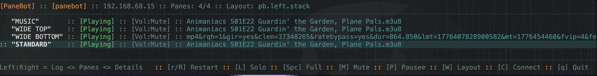

#  PaneBot
### Just the streams.

Multi-pane mpv controller with a terminal UI and browser extension. Run it locally, or run the daemon on any machine and control it from anywhere on your network.
<br>
<div align="center">
[ [Concept](#concept) | [Use Cases](#use-cases) | [Design](#design) | [Quick Start](#quick-start) | [Reference](#reference) ]
</div>



---

## Concept

PaneBot manages mpv instances — one per pane. The daemon handles launching, monitoring, and IPC. The TUI controls them. The browser extension sends URLs directly to any pane from any tab.

Run `panebot-tui` and the daemon starts automatically. Define your panes, set your layouts, and you have the full mpv surface across as many windows as you want. Put the daemon in remote mode and it accepts connections over WSS — the TUI and extension behave identically whether the daemon is local or on a machine across the room.

PaneBot doesn't duplicate mpv. It controls it. Every mpv feature, script, and config you already use works exactly as it does today.

```
Browser Extension
   (URL ingress)
      │
      │ wss://
      ▼
┌─────────────────────────────────────────────┐
│  PaneBot Dashboard (panebot-tui)            │
│  Terminal UI — connects to any daemon       │
└────────────────┬────────────────────────────┘
                 │ wss://
        ┌────────┴────────┐
        │                 │
        ▼                 ▼
┌──────────────┐   ┌──────────────┐
│  PaneBot     │   │  PaneBot     │
│  Daemon      │   │  Daemon      │
│  (local)     │   │  (remote)    │
└──────┬───────┘   └──────┬───────┘
       │ IPC              │ IPC
  ┌────┴────┐        ┌────┴────┐
  │   mpv   │        │   mpv   │  ×N
  │  ×N     │        │         │
  └─────────┘        └─────────┘
```

---

## Use Cases

- Multi-screen media walls and art installations
- Event and venue AV control from a single operator machine
- Broadcast and security feed monitoring across named panes
- Remote machines running PaneBot, controlled over the network
- Send any URL from a browser tab to any pane with one click
- Development and testing of mpv-based pipelines and scripts

---

## Design

**`panebot-daemon`** — Async Tokio WebSocket server (port 9090, WSS). The only process that owns mpv. Spawns and monitors mpv instances over Unix IPC sockets, broadcasts typed events to all connected clients. In `local` mode binds to `127.0.0.1`; in `remote` mode binds to `0.0.0.0` and accepts LAN connections. Self-signed TLS cert generated on first boot (`pb.crt`, `pb.key`).

**`panebot-tui`** — Ratatui terminal dashboard. Connects to any daemon over WSS. Three-screen navigation: `Log ←→ Panes ←→ Details (Playlist)`. Pane state — playing, paused, volume, title, position — updates live from the daemon. Command mode (`Tab`) passes input directly to mpv. Switch between daemons with `C`.

**Browser extension** — Adds a context menu item to any page. Right-click → Send to PaneBot → choose daemon and pane. Works with any URL mpv can open.

```
panebot/
├── Cargo.toml              — workspace root
├── panebot-lib/            — shared types, config parsers, M3U utilities
├── panebot-daemon/         — Tokio async WebSocket server, mpv IPC
└── panebot-tui/            — Ratatui terminal controller
```

Binaries link statically. No shared runtime required. See [`docs/architecture.md`](docs/architecture.md) for the full design.

---

## Playlists and Live State

mpv is truth. The `.m3u` file is a launch config, not a live record. Once mpv is running, the daemon queries its IPC socket for current state. The TUI reflects live mpv — not what's on disk.

From the Details (Playlist) screen you can queue, delete, move, crop, search, and add items — and save the live playlist back to any path you choose (`S`).

```
pb.panes.conf ──► mpv --playlist=music.m3u
                       │
                       ▼
                  [mpv running]
                       │
              observe_property: pause, volume,
              media-title, playlist-pos, mute,
              idle-active
                       │
                       ▼
              panebot-daemon broadcasts
              DaemonEvent::PropertyChange
              to all connected clients
```

---

## Quick Start

### macOS

```bash
git clone https://github.com/marlovious/panebot
cd panebot
cargo install --path panebot-daemon
cargo install --path panebot-tui

# daemon starts automatically on first launch
panebot-tui
```

### Linux

```bash
git clone https://github.com/marlovious/panebot
cd panebot
cargo install --path panebot-daemon
cargo install --path panebot-tui

# daemon starts automatically on first launch
panebot-tui
```

On Linux, window placement is handled by your WM — panes spawn in the order defined in `pb.panes.conf` and you arrange them however you want. A Hyprland rules file is generated on bootstrap as a convenience.

To run the daemon as a systemd user service so it starts with your session:

```bash
systemctl --user enable --now panebot-daemon
```

**Browser extension:** the daemon's self-signed certificate must be trusted in your browser before the extension will work. Visit `https://host:9090` once per machine and accept the certificate.

For a dedicated remote display, see [panebot-node](https://github.com/marlovious/panebot-node).

---

## Reference

### Directory Layout

```
~/.config/panebot/
├── pb.panes.conf          # pane definitions + active layout
├── pb.daemon.conf         # mode (local/remote) + known remote daemons
├── pb.crt                 # TLS certificate (auto-generated)
├── pb.key                 # TLS private key (auto-generated)
├── pb.hypr.conf           # Hyprland window rules (sourced by hyprland.conf)
├── panebot-daemon.log     # daemon log
├── layouts/
│   ├── pb.left.stack.layout
│   └── pb.right.stack.layout
├── music/
│   ├── music.mpv.conf
│   ├── music.m3u          # playlist — launch config and save target
│   ├── music.sock         # mpv IPC socket
│   └── scripts/
├── wide-top/
├── wide-bottom/
└── standard/
```

Each pane gets its own directory. The `.mpv.conf` is written once by bootstrap and edited freely. The `.m3u` is the launch playlist.

---

### Configuration

#### `pb.panes.conf`

```ini
layout = pb.left.stack

[music]
pane_name = Music

[wide-top]
pane_name = Wide Top

[wide-bottom]
pane_name = Wide Bottom

[standard]
pane_name = Standard
```

The section header is the `mpv_name` — permanent identifier that drives the directory, socket, and config file. `pane_name` is display only.

#### `pb.daemon.conf`

```ini
# mode = local    bind to 127.0.0.1 (default)
# mode = remote   bind to 0.0.0.0, accept LAN connections

mode = remote

[remote-display]
address = wss://192.168.1.x:9090
```

#### Layout files

```ini
# ~/.config/panebot/layouts/pb.left.stack.layout

[music]
geometry = 366x366+0+0

[wide-top]
geometry = 650x366+0+374
```

On macOS, geometry is passed as `--geometry` to mpv — PaneBot positions the windows. On Linux, geometry is ignored — panes spawn in order and window placement is managed by your WM. A Hyprland rules file (`pb.hypr.conf`) is generated on bootstrap as a convenience.

---

### Key Bindings

#### Dashboard

| Key | Action |
|-----|--------|
| `j` / `k` / `↑` / `↓` | Navigate panes |
| `h` / `l` / `←` / `→` | Switch screen (Log ↔ Panes ↔ Details (Playlist)) |
| `Tab` | Enter command mode |
| `S` | Solo pane (mute others, fullscreen, play) |
| `M` | Mute all others |
| `P` | Pause / unpause all |
| `r` | Restart selected pane |
| `R` | Restart all panes |
| `W` | Switch layout |
| `C` | Connect to different daemon |
| `q` | Quit |

#### Command Mode (`Tab`)

| Key | Action |
|-----|--------|
| `Space` | Toggle pause |
| `m` | Toggle mute |
| `f` | Toggle fullscreen |
| `h` / `l` / `←` / `→` | Seek ±5s |
| `j` / `k` / `↑` / `↓` | Seek ±60s |
| `9` / `0` | Volume ±5 |
| `v` | Enter mpv passthrough |
| `Tab` | Exit command mode |

#### Details (Playlist)

| Key | Action |
|-----|--------|
| `j` / `k` / `↑` / `↓` | Navigate items |
| `Enter` | Play now |
| `n` | Queue next |
| `Space` | Mark item |
| `/` | Search |
| `D` | Delete item(s) |
| `M` | Move marked items |
| `C` | Crop to marked / playing |
| `A` | Add URL or path |
| `S` | Save playlist |
| `G` | Jump to index |
| `h` / `←` | Back to dashboard |

#### mpv Passthrough (`v`)

All keys forward directly to mpv. Exit with `v`.

---

### Requirements

- mpv
- Rust (build only)

---

## License

MIT
